# Programación concurrente, condiciones de carrera y sincronización de hilos.

## Integrantes
- Laura Natalia Perilla Quintero - [Lanapequin](https://github.com/Lanapequin)
- Santiago Botero Garcia - [LePeanutButter](https://github.com/LePeanutButter)

## Parte I. – Análisis y optimización de recursos en un sistema productor/consumidor multihilo.

Control de hilos con wait/notify. Productor/consumidor.

1. Revise el funcionamiento del programa y ejecútelo. Mientras esto ocurren, ejecute jVisualVM y revise el consumo de CPU del proceso correspondiente. A qué se debe este consumo?, cual es la clase responsable?

El mayor consumo que se evidencio fue un 30.6% en CPU, con un consumo promedio de 14% y 17 hilos corriendo, con respecto al heap size en memoria es de 260 MB el pico fue de 31 MB, es un 15.5% de la memoria asignada.

2. Haga los ajustes necesarios para que la solución use más eficientemente la CPU, teniendo en cuenta que -por ahora- la producción es lenta y el consumo es rápido. Verifique con JVisualVM que el consumo de CPU se reduzca.

Consumo promedio de 0.7% en CPU y el maximo fue de 1.8%, el heap size en memoria es de 260 MB y el pico fue de 17 MB.

3. Haga que ahora el productor produzca muy rápido, y el consumidor consuma lento. Teniendo en cuenta que el productor conoce un límite de Stock (cuantos elementos debería tener, a lo sumo en la cola), haga que dicho límite se respete. Revise el API de la colección usada como cola para ver cómo garantizar que dicho límite no se supere. Verifique que, al poner un límite pequeño para el 'stock', no haya consumo alto de CPU ni errores.

Para hacer que el productor produzca muy rápido, y el consumidor consuma lento, se utilizo scheduleAtFixedRate para crear una tarea periodica y que esta se ejecute cada cierto tiempo.

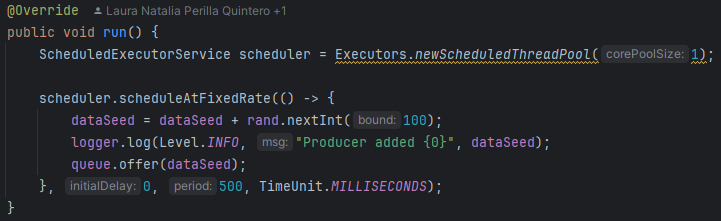
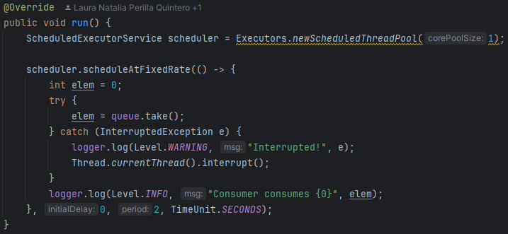

En el punto anterior, se implemento offer y take, lo cuales son metodos que permiten agregar y eliminar elementos de una cola, sin incurrir en problemas de rango y manejo de hilos sincronizado.

Se puso un limite de 10 para el stock y se verifico con jVisualVM que no hubiera un consumo alto de CPU ni errores.

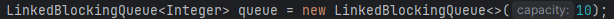
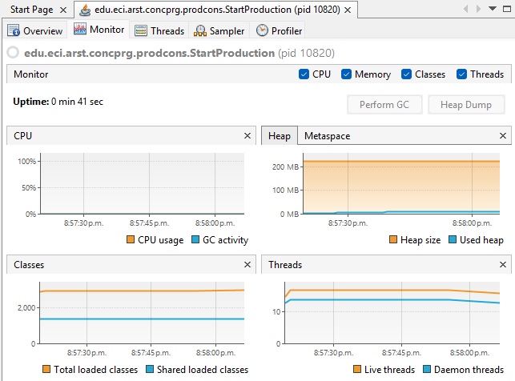

El consumo promedio fue de 0.2% en CPU y el maximo fue de 0.6%, el heap size en memoria es de 234 MB y el pico fue de 13 MB.

## Parte II. – Búsqueda distribuida eficiente con control de condiciones de carrera y sincronización atómica.

Teniendo en cuenta los conceptos vistos de condición de carrera y sincronización, haga una nueva versión -más eficiente- del ejercicio anterior (el buscador de listas negras). En la versión actual, cada hilo se encarga de revisar el host en la totalidad del subconjunto de servidores que le corresponde, de manera que en conjunto se están explorando la totalidad de servidores. Teniendo esto en cuenta, haga que:

- La búsqueda distribuida se detenga (deje de buscar en las listas negras restantes) y retorne la respuesta apenas, en su conjunto, los hilos hayan detectado el número de ocurrencias requerido que determina si un host es confiable o no (_BLACK_LIST_ALARM_COUNT_).
- Lo anterior, garantizando que no se den condiciones de carrera.

Para darle solucion a esto que nos estan pidiendo, los cambios implementados fueron los siguientes:
- Se creo una variable compartida entre todos los hilos, de tipo AtomicInteger, la cual permite que múltiples hilos sumen al mismo contador sin producir condiciones de carrera y una bandera de tipo volatile ya que esta nos garantiza que todos los hilos vean su valor actualizado inmediatamente.

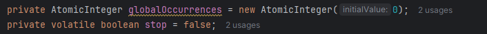

- En la clase IPReputationSearch, cada hilo antes de revisar un servidor pregunta si la bandera esta activa, con el fin de que si esto se cumple, el hilo pare y deje de buscar, ahora, si esto no se ha cumplido, el hilo entra en el ciclo y si encuentra
una coincidencia la registra en su lista local e incrementa el contador global, si este contador alcanza el limite de BLACK_LIST_ALARM_COUNT, el hilo activa la bandera para que todos los demás hilos dejen de buscar.

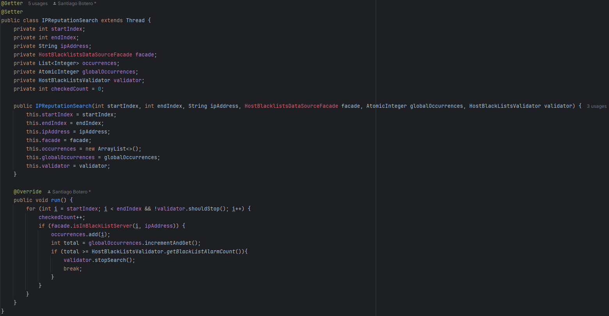

- Como resultado, se observa en terminal que disminuyo el tiempo de ejecucion y ya no se revisan innecesariamente todos los servidores.

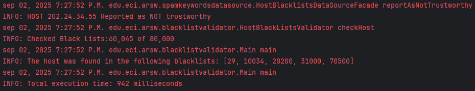

## Parte III. – Sincronización, Deadlocks y Estabilidad en Sistemas Concurrentes

Este es un juego con N jugadores inmortales, donde cada uno conoce a los demás. Durante la partida, cada jugador ataca constantemente a otro jugador elegido al azar. Cada vez que ataca, le quita M puntos de vida al oponente y suma esos mismos puntos a su propia vida.

El juego no siempre llega a tener un único ganador. En muchos casos, puede terminar en una situación donde solo quedan dos jugadores atacándose mutuamente, infligiéndose y recuperando exactamente la misma cantidad de vida al mismo ritmo.

Cuando ambos jugadores atacan al mismo tiempo, se genera un bucle infinito (deadlock), ya que la cantidad de vida que uno pierde es exactamente la que el otro gana, y viceversa. Esto hace que el sistema entre en un estado estable en el que ningún jugador puede morir, y el programa nunca finaliza.

Un invariante del sistema es que la sumatoria total de las vidas de todos los jugadores se mantiene constante en los momentos en que no se están realizando ataques** (es decir, cuando no hay procesos simultáneos de reducción y adición de vida).

Este invariante se expresa como:

$$
n \times 100
$$

Donde:

- \( n \) es el número de jugadores inmortales.
- 100 es el valor definido por la constante `DEFAULT_INMORTAL_HEALTH`, que representa la vida inicial de cada jugador.

En el constructor por defecto de la clase `ControlFrame`, el campo `numOfImmortals` (un objeto `JTextField`) se inicializa con el valor `"3"`, lo que indica que al comenzar el juego siempre hay 3 jugadores inmortales. Por lo tanto, durante la partida, el invariante de la suma total de vida es:

$$
3 \times 100 = 300
$$

La opción Pause and Check permite visualizar el nombre de cada inmortal junto a su vida actual, así como la sumatoria total de vida en ese momento. Se realizaron cuatro pruebas consecutivas durante la misma ejecución del programa, cuyos resultados se muestran a continuación:

En esta primera prueba, la sumatoria total de vida fue de 270, lo cual es inferior al valor esperado de 300 (para 3 inmortales con 100 de vida cada uno).

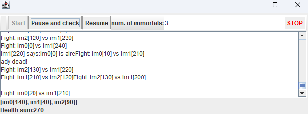

En la segunda prueba, la suma total fue de 360, superando el valor invariante esperado.

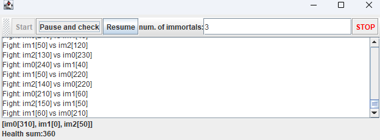

En la tercera captura, la vida total alcanzó los 410, nuevamente por encima del valor correcto.

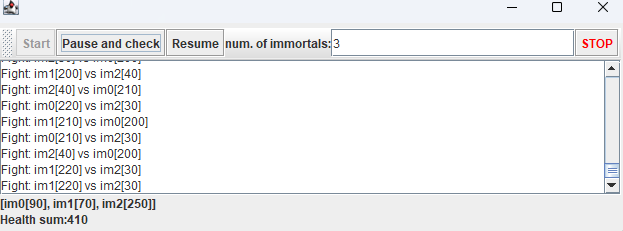

Finalmente, en la cuarta prueba, la suma descendió a 210, por debajo del invariante.

Estos resultados evidencian un claro problema de sincronización en el manejo concurrente de la vida de los inmortales.

La razón por la que los resultados no se mostraban correctamente se debía a un problema de sincronización en el manejo concurrente de la vida de los jugadores. Por esta razón, se refactorizó la funcionalidad del botón Pause and Check para que pueda pausar correctamente el hilo, y se añadió un botón de Reanudar para controlar la ejecución.

Sin embargo, durante la pelea persistían problemas de sincronización. Las regiones críticas donde podían ocurrir condiciones de carrera estaban principalmente en los métodos changeHealth y getHealth. Dado que el campo health es un dato compartido entre varios hilos, la opción de sincronización más adecuada fue cambiar el tipo de dato de health de int a AtomicInteger. Este tipo proporciona métodos atómicos para añadir y obtener valores, facilitando el control concurrente en Java.

Además, para evitar problemas adicionales, se decidió eliminar el método changeHealth, que cumplía una función similar a un setter. Esto se debe a que la combinación get() -> set() sin sincronización puede provocar inconsistencias por la gestión de la memoria (hash en memoria), especialmente si múltiples hilos acceden simultáneamente.

En su lugar, se utilizó el método addAndGet() de AtomicInteger para actualizar la vida, permitiendo controlar con precisión cuándo un jugador pierde o gana vida, abarcando así las tres regiones críticas de sincronización.

Se realizaron tres pruebas diferentes para verificar la efectividad del refactor:

Se observa que la sumatoria total de vida se mantiene constante y se cumple el invariante esperado.

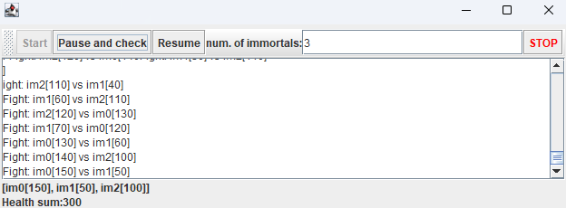

El sistema mantiene la vida correctamente sincronizada, sin valores por encima o por debajo del invariante.

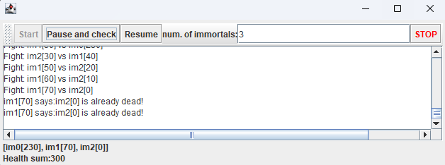

Se confirma la estabilidad del sistema sin bloqueos ni inconsistencias en la vida de los jugadores.

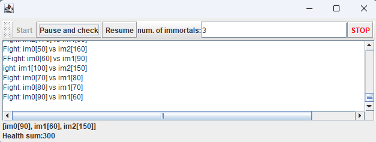

Con esta aproximación se logró cumplir el invariante del sistema, es decir, que la suma total de vida de todos los jugadores se mantiene constante en ausencia de ataques simultáneos. Además, esta implementación evita la necesidad de sincronización anidada para el control de la vida durante la pelea, eliminando posibles deadlocks que antes causaban bloqueos y detenían la ejecución del programa.

Antes del cambio, los métodos getHealth y changeHealth al estar sincronizados de forma anidada podían causar bloqueos, especialmente cuando varios hilos intentaban acceder y modificar la vida simultáneamente. La solución basada en AtomicInteger y el uso de addAndGet() resolvió estos problemas y mejoró la estabilidad y consistencia del juego.

El programa aún presentaba problemas importantes: no contaba con una condición de finalización clara y resultaba molesto cuando un inmortal intentaba atacar a otro que ya había muerto. Para solucionar esto, se refactorizó el método `run` de la clase Inmortal, de modo que al morir, el hilo correspondiente se interrumpe y finaliza su ejecución. Además, en lugar de seleccionar al azar otro inmortal por índice, ahora se elige entre los hilos que siguen vivos. Cuando solo queda uno, se le declara como ganador.

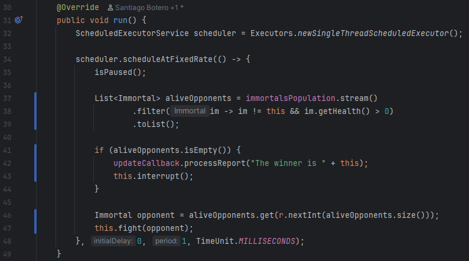

Con esta nueva implementación, se probó el programa y se obtuvo el siguiente resultado, que confirma que la ejecución se detiene correctamente al llegar a un único ganador y que no se realizan ataques a inmortales muertos. También se verificó que los botones de pausa y reanudación funcionan correctamente, lo que representa un éxito en la refactorización.

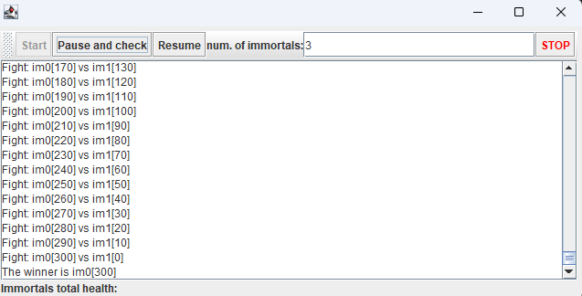

Con el objetivo de verificar que el invariante del sistema se mantiene tras la refactorización, se realizaron pruebas de ejecución con diferentes cantidades de hilos: 100, 1000 y 10000 inmortales activos. En cada caso, se observó el comportamiento del sistema y se registraron los resultados mediante capturas de pantalla.

**Pruebas con 100 hilos**
- En esta configuración, el sistema se comportó de forma estable.
- La suma total de vida se mantuvo constante, cumpliendo el invariante esperado de
$$
100 \times 100 = 10000
$$
- No se observaron inconsistencias ni bloqueos.

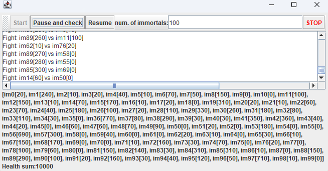

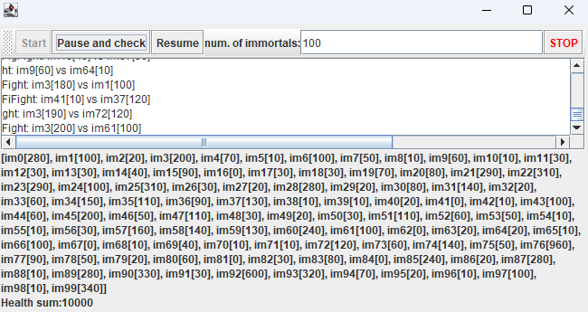

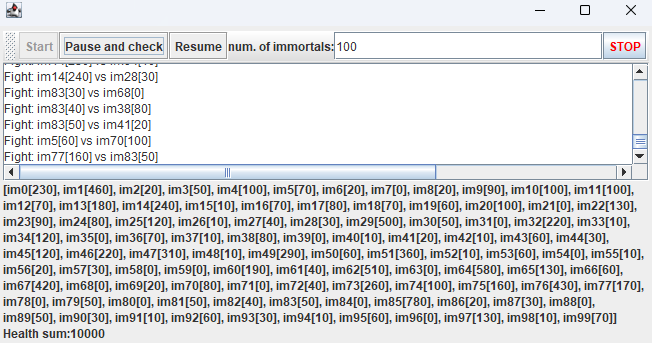

**Pruebas con 1000 hilos**

- El sistema continuó cumpliendo el invariante de vida total:
$$
1000 \times 100 = 100000
$$
- Aunque la ejecución fue más lenta, no se detectaron errores de sincronización ni inconsistencias en los valores de vida.
- Se mantuvo la estabilidad general del programa.

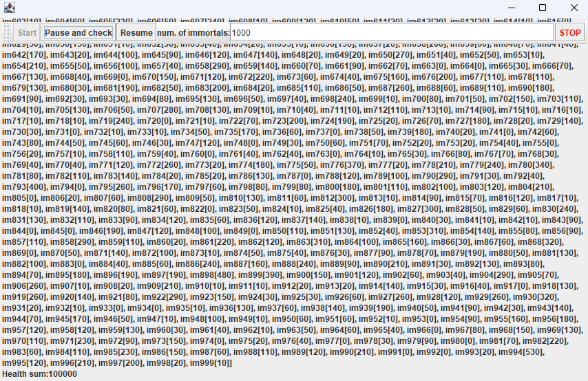

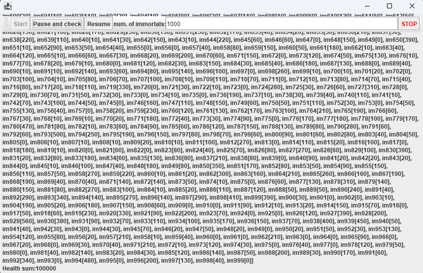

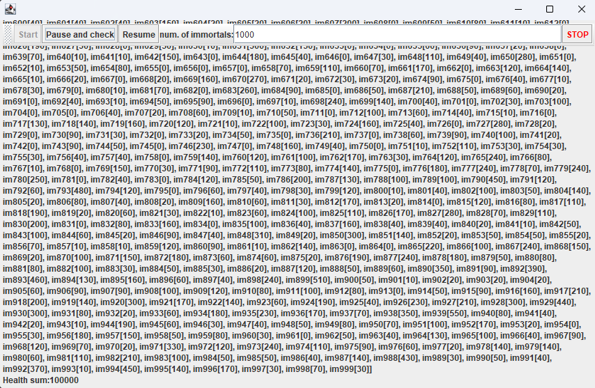

**Pruebas con 10000 hilos**
- El sistema logró mantener el invariante teórico de:
$$
10000 \times 100 = 1000000
$$
puntos de vida total.

- Sin embargo, se evidenciaron problemas de rendimiento significativos:
  - La interfaz se volvió poco responsiva.
  - La ejecución se prolongó excesivamente.
  - El sistema mostró signos de saturación de recursos.

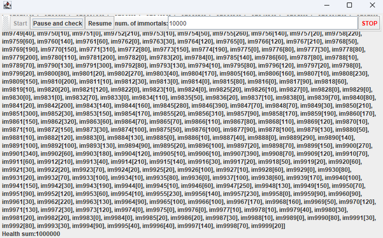

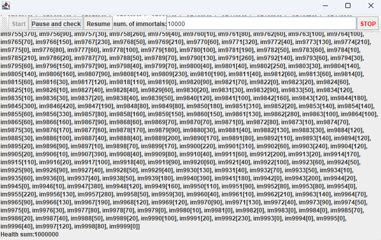

Debido a los problemas de rendimiento observados en la prueba con 10000 hilos, se decidió implementar un botón de "Stop" que permite finalizar la ejecución del programa de forma anticipada. Esta funcionalidad resulta especialmente útil en escenarios de alta carga, donde el sistema puede tardar demasiado en alcanzar una condición de finalización natural.

Con esta mejora, se ofrece al usuario un mayor control sobre la ejecución, evitando bloqueos prolongados y permitiendo interrumpir el juego en cualquier momento sin comprometer la integridad del sistema.

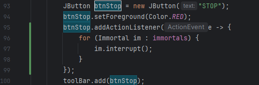

También se implementó una lógica para garantizar que todos los hilos finalicen correctamente cuando sean interrumpidos. Para ello, se modificó el comportamiento del scheduler, de modo que se apague inmediatamente al detectar que ha sido interrumpido.

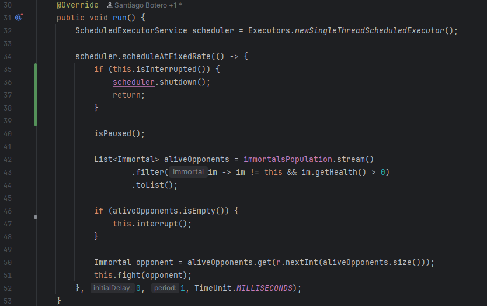

Gracias a esta refactorización, el botón Stop ahora interrumpe la ejecución de forma efectiva, deteniendo todos los hilos activos y finalizando el programa sin dejar procesos pendientes.

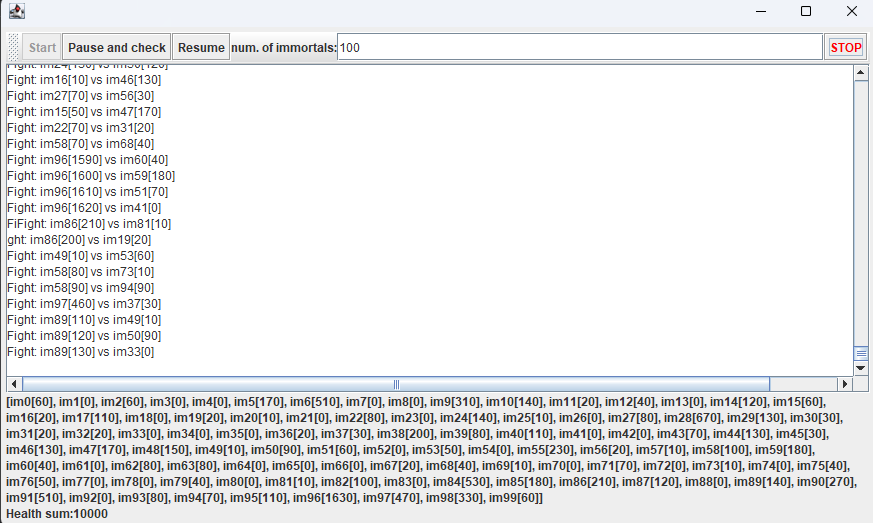